# Panorama Stitching
 
In this repository, we attempt to solve the problem of automatically stitching several images that are possibly in a panorama.

## Approach

There are 4 major things that in this task:
- Matching features
    - This has been done using the inbuilt ORB feature descriptor finder.
    - To match features, we use the inbuilt BF matcher that brute forces matches between ORB features between two images using a distance function.
- Finding the homography matrix
    - We use the RANSAC algorithm with a total of 10000 trials, taking 4 matches at a time to estimate the Homography.
- Warping images
    - Given a homography, 2 methods of warping have been implemented
        - Forward projection: Here, for each pixel in the source image, we project the pixel onto a warped image. However, this causes holes in the projected image.
        - Inverse sampling: Here, we compute the Inverse homography matrix, and sample pixels for each destination pixel from the source image. This solves the problem of having holes.

    - In order to speed up the process, the transformation has been converted from a O(n^2) loop to a matrix multiplication using the indices.

- Blending images
    - In order to blend the images, we use the method of pyramids.
        - First, we compute the laplacian pyramid for each of the images.
        - We also compute the gaussian pyramid for the mask of the images.
        - We employ 2 strategies for stitching
            - Vertical stitching: We use a simple left - right split to stitch the images at each level of the laplacian pyramid.
            - Diagonal stitching: We use a diagonal stitch over the overlay. This allows a large portion of the images to be retained after stitching.

## Implementation Specifics

- It is assumed that the order of the images in the dataset is sorted from left to right, and is alphabetically arranged with respect to the same

- Since the ORB feature descriptor is not very robust, we notice that the homography matrix computed is often incorrect. Moreover, we notice that even the inbuilt homography estimator using the ORB descriptor is not very good. We hence attribute this to improper feature descriptors and bad matching. An example is seen here:

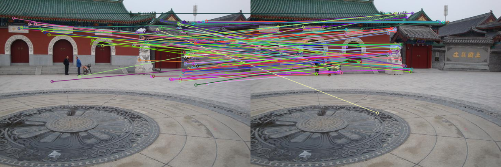

We can clearly see that the matches are not good.

- Due to the stitching method, we see that the results are ocasionally such that the stitching happens by not utilizing all of the data. This is because of the vertical/diagonal stitching method.

- Ocasionally, we notice that the warping fails since the warped image doesnt fit within the temporary image buffer. This can be fixed by changing the image size.

## Results

All the results can be viewed in the `outputs/*/*` directory.

Disclaimer: The image has been cropped manually just for the sake of viewing in the Readme.

### Custom Implementation

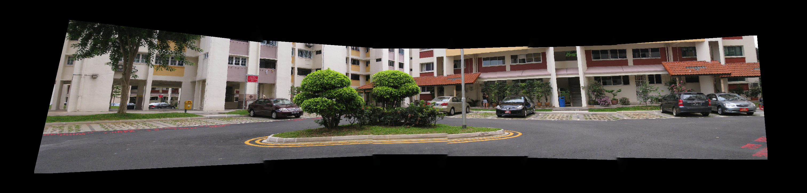

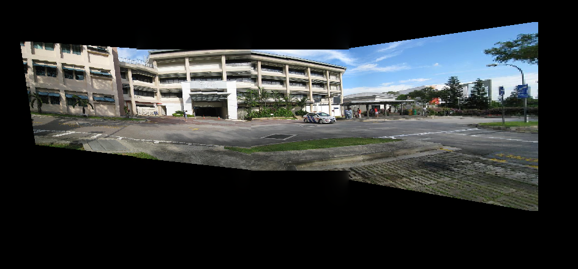

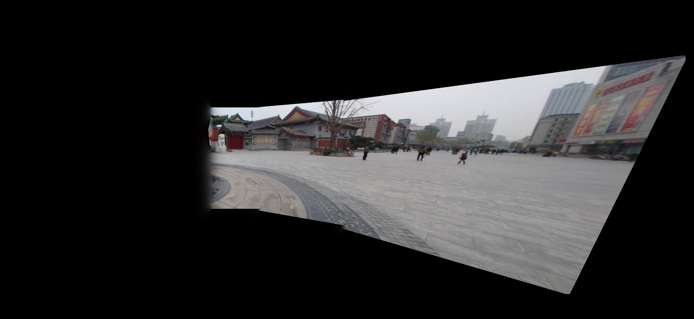

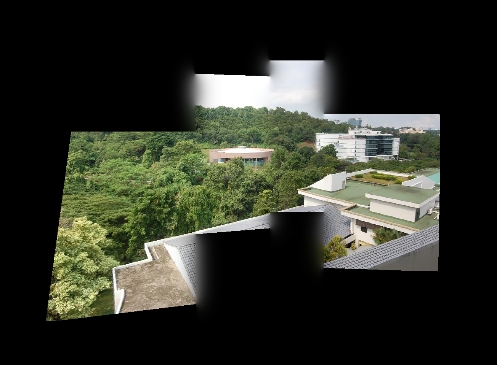

### OpenCV Implementation

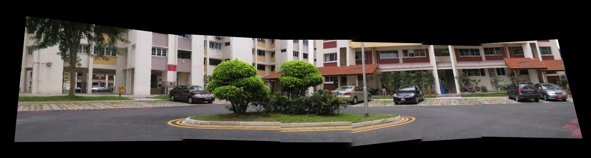

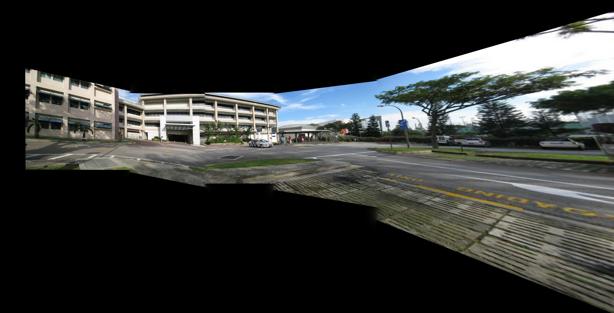

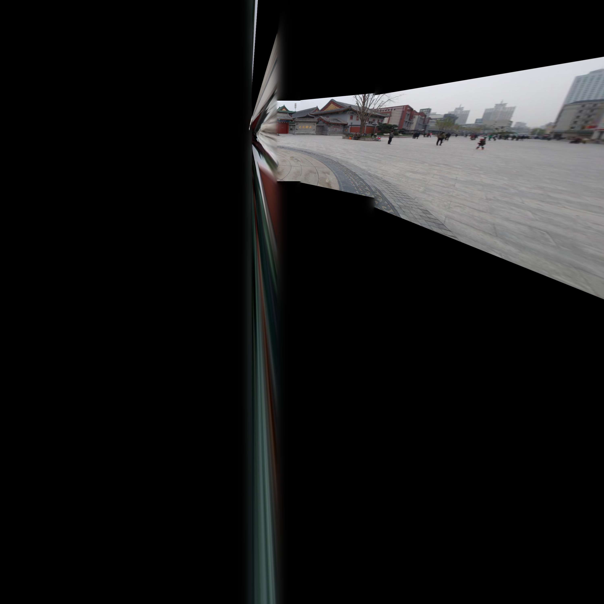

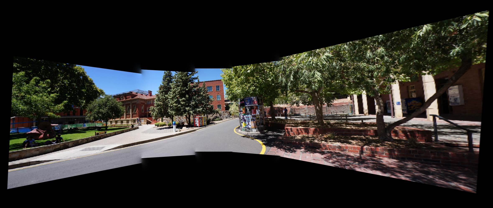

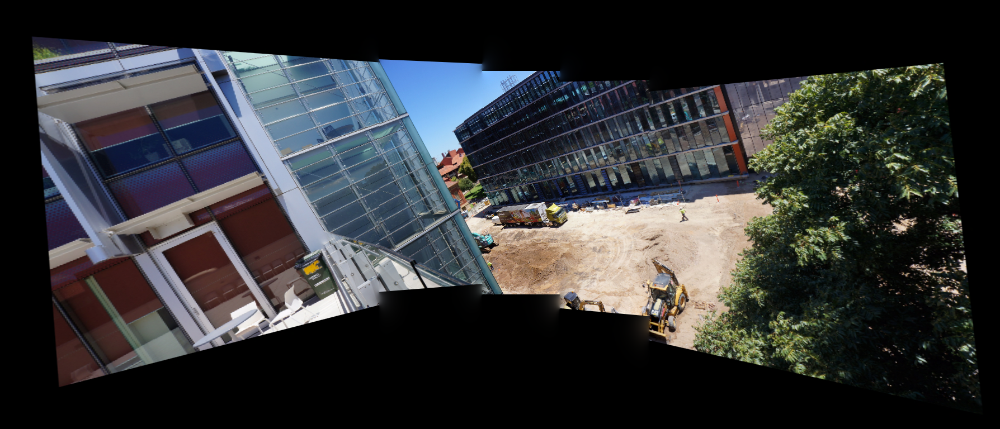

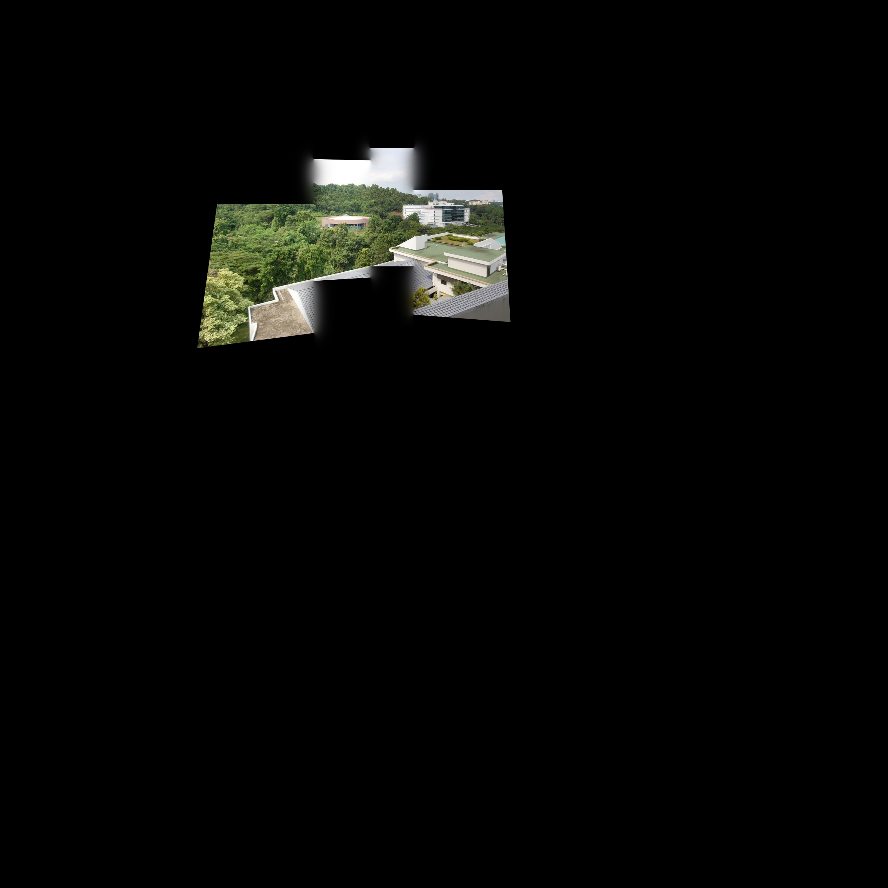

We can see that both the OpenCV result and custom result are similar. In some cases, we see that the OpenCV estimation is infact worse than the custom implmentation (Set 2, 3). This is again due to the poor estimation of ORB features.

## Usage

This repository implements the following:
- Matching features between two images using OpenCV functions (ORB descriptors) - `main.py`
- Estimating the best homography matrix between the images using RANSAC - `main.py`
- Implementation of laplacian stitching to stitch the images - `blending.py`
- Using inbuilt functions to estimate homography - `opencvBlender.py`

- To run the script, clone the repository, and change the `imageSet` variable in the file to match the set that you want to run it on.
- Run the script from the terminal using `python main.py`

